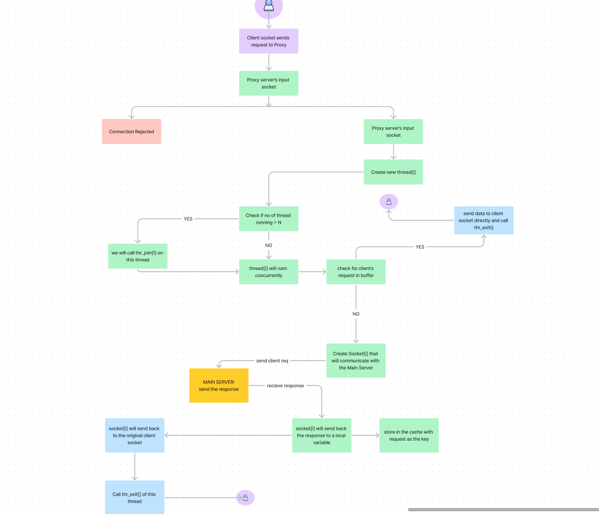

# proxy_server_in_c(multi-threaded)


## Overview

This project implements a multi-threaded proxy server using semaphores for concurrency control. It handles multiple client requests, caching using the LRU algorithm, and demonstrates proxy functionalities.

## Key Features

- **Threading**: Manages multiple client requests.
- **Semaphore**: Used instead of condition variables and `pthread_join()`/`pthread_exit()`. Semaphores' `sem_wait()` and `sem_post()` do not need parameters, making them a better option.
- **Cache**: Speeds up processing (LRU algorithm).

## Limitations

- Separate cache entries for URLs with multiple clients.
- Fixed cache element size.

## Future Enhancements

- Multiprocessing for better performance.
- Selective website access control.
- Support for POST requests.

## Usage

1. Clone the repository:

2. Navigate to the project directory:

3. Build the project:
    ```sh
    make all
    ```

4. Run the proxy server:
    ```sh
    ./proxy <port no.>
    ```

5. Open in browser:
    ```sh
    http://localhost:<port>/any link u want to test (eg--www.google.com)
    ```

## Notes

- Linux only. Disable browser cache.
- For no-cache version, rename `proxy_server_with_cache.c` to `proxy_server_without_cache.c` in the MakeFile.
